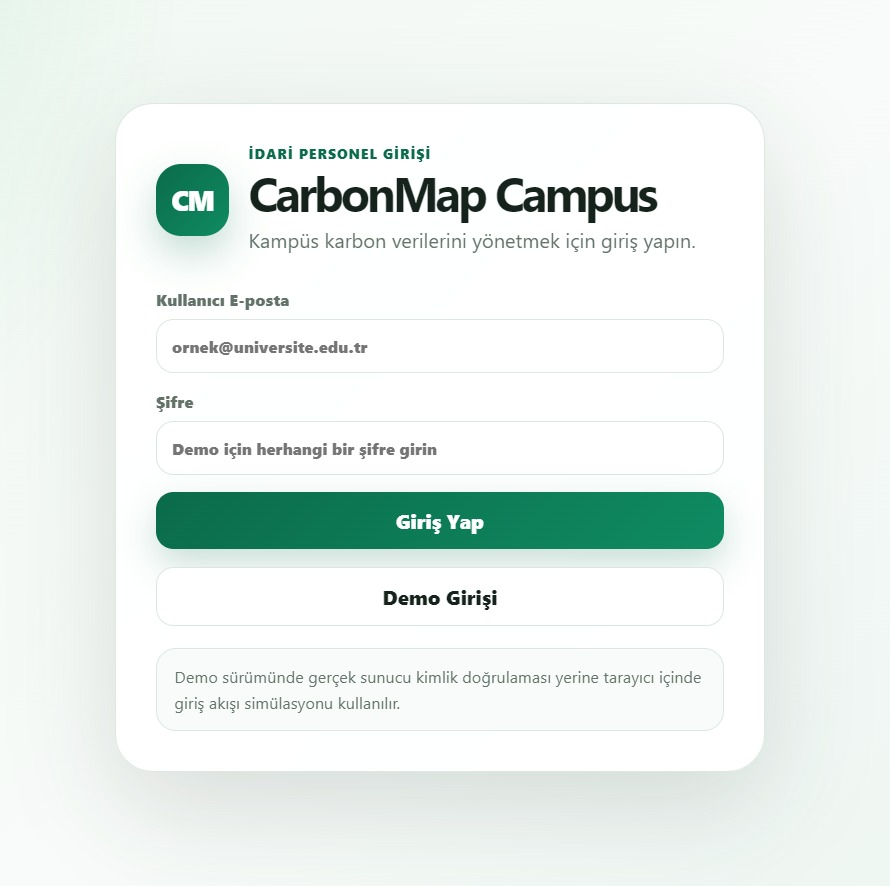
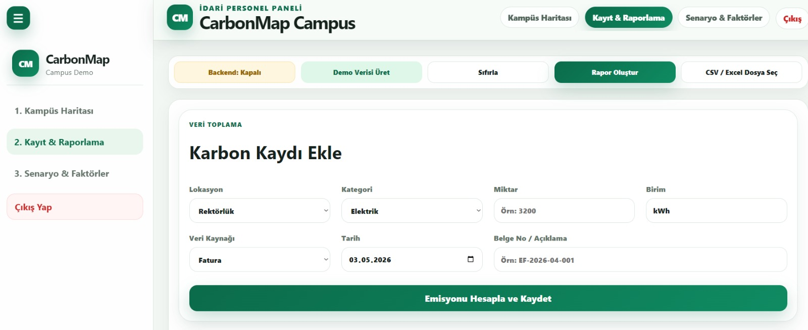
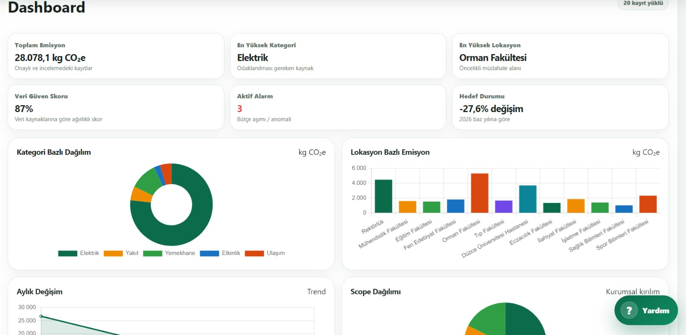
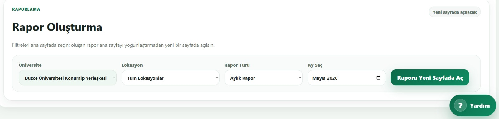
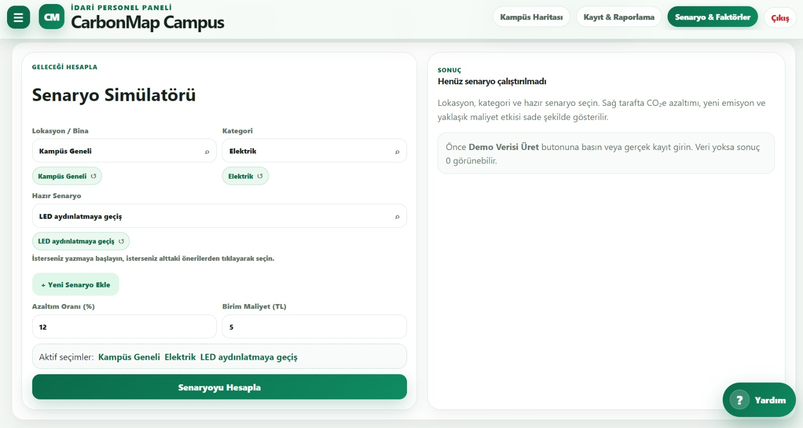
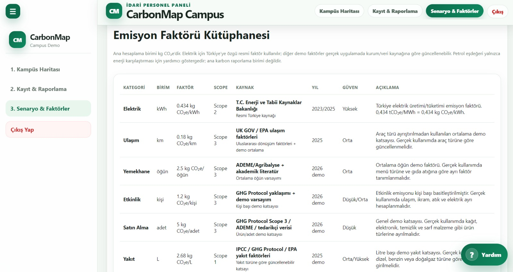

# CarbonMap Campus
**Takım Adı:** LogicWaves

**Drive Link:** https://docs.google.com/presentation/d/1nAhW9CT8Y1hqtgf7TGo3hO-iwKPIYYFo/edit?usp=sharing&ouid=111547560160736652840&rtpof=true&sd=true


**CarbonMap Campus**, üniversite kampüslerinde oluşan karbon ayak izini takip etmek, analiz etmek, raporlamak ve azaltım senaryoları üretmek için geliştirilen hackathon prototipidir.

Proje; idari personelin Excel tabanlı dağınık takip sürecini daha anlaşılır, görsel ve karar destekli bir web paneline dönüştürmeyi amaçlar. Kullanıcılar kampüs lokasyonlarını harita üzerinde görebilir, karbon kayıtları ekleyebilir, CSV/Excel dosyası aktarabilir, dashboard üzerinden emisyon dağılımlarını inceleyebilir, senaryo simülatörü ile azaltım etkisini hesaplayabilir ve rapor önizlemesi üzerinden PDF/Excel çıktısı alabilir.

---

## Proje Özeti

Üniversitelerde elektrik, ulaşım, yemekhane, etkinlik, satın alma ve yakıt gibi farklı kaynaklardan karbon emisyonu oluşur. Bu veriler çoğu zaman farklı birimlerde, farklı Excel dosyalarında veya manuel listelerde tutulduğu için yöneticilerin bütün resmi görmesi zorlaşır.

**CarbonMap Campus**, bu sorunu çözmek için:

- Ham tüketim verisini alır.
- Veriyi uygun emisyon faktörüyle kgCO₂e değerine çevirir.
- Hangi bina, lokasyon veya faaliyetin daha fazla emisyon ürettiğini gösterir.
- Dashboard, harita ve grafiklerle karar desteği sunar.
- Azaltım senaryoları ile tahmini çevresel ve maddi faydayı hesaplar.
- PDF/Excel rapor çıktısı oluşturmadan önce web üzerinde rapor önizlemesi sağlar.

---

## Hedef Kullanıcı

Bu prototip özellikle **üniversite idari personeli** için tasarlanmıştır.

Hedeflenen kullanıcılar:

- İdari ve Mali İşler birimi
- Yapı İşleri / Teknik birimler
- Sürdürülebilirlik ofisi
- Kampüs yönetimi
- Rektörlük veya yönetim raporlama ekipleri

---

## Temel Özellikler

### 1. Kullanıcı Girişi

- Demo kullanıcı ile hızlı giriş yapılabilir.
- Yeni kullanıcı kayıt ekranı bulunur.
- Demo sürümünde kimlik doğrulama tarayıcı tarafında simüle edilir.

**Demo giriş bilgileri:**

```text
E-posta: idari.personel@carbonmap.edu.tr
Şifre: demo123
```

### 2. Dinamik Kampüs Haritası

- Kampüs lokasyonları harita üzerinde gösterilir.
- Hazır kampüs seçenekleri kullanılabilir.
- Kullanıcı farklı üniversite araması yapabilir.
- Harita, seçilen üniversiteye göre yeniden konumlanır.
- Lokasyonlar emisyon/risk durumuna göre renklendirilir.

### 3. Karbon Kaydı Ekleme

Kullanıcı aşağıdaki alanlarla karbon kaydı oluşturabilir:

- Lokasyon
- Kategori
- Tüketim miktarı
- Veri kaynağı
- Kayıt durumu
- Tarih
- Açıklama

Sistem, kategoriye göre ilgili birimi ve emisyon faktörünü kullanarak toplam emisyonu otomatik hesaplar.

### 4. CSV / Excel Aktarımı

- `.csv`, `.xlsx` ve `.xls` dosyaları desteklenir.
- Kullanıcı dosyadaki sütunları sistem alanlarıyla eşleştirebilir.
- Toplu veri aktarımı yapılabilir.
- Bu özellik, Excel’den sisteme geçişi kolaylaştırmak için eklenmiştir.

### 5. Dashboard

Dashboard üzerinde:

- Toplam emisyon
- En yüksek kategori
- En yüksek lokasyon
- Veri güven skoru
- Kategori dağılımı
- Lokasyon dağılımı
- Aylık/yıllık trend grafiği
- Scope 1 / Scope 2 / Scope 3 dağılımı

görüntülenir.

### 6. Rapor Önizleme

PDF veya Excel çıktısı alınmadan önce rapor web sayfasında gösterilir.

Rapor filtreleri:

- Üniversite / kampüs
- Lokasyon
- Aylık rapor
- Yıllık rapor

Rapor sayfasında kullanıcı önce sonucu kontrol eder, sonra isterse:

- PDF olarak yazdırır.
- Excel olarak indirir.

### 7. Senaryo Simülatörü

Kullanıcı azaltım senaryosu seçerek veya yeni senaryo tanımlayarak şu sorulara cevap alabilir:

- Bu aksiyon uygulanırsa ne kadar emisyon azalır?
- Yeni emisyon değeri ne olur?
- Tahmini maliyet faydası nedir?
- Bu aksiyon kısa vadeli mi, uzun vadeli mi?
- Hangi birim bu aksiyondan sorumlu olabilir?

Örnek senaryolar:

- LED aydınlatmaya geçiş
- Mesai dışı cihaz kapatma politikası
- Hareket sensörlü aydınlatma
- Gıda israfı takibi
- Servis optimizasyonu
- Satın alma politikası iyileştirmesi

### 8. Emisyon Faktörü Kütüphanesi

Sistemde kullanılan kategoriler ve örnek faktörler:

| Kategori | Birim | Scope | Açıklama |
|---|---:|---|---|
| Elektrik | kWh | Scope 2 | Elektrik tüketimi kaynaklı emisyon |
| Ulaşım | km | Scope 3 | Servis, araç veya ulaşım kaynaklı emisyon |
| Yemekhane | öğün | Scope 3 | Öğün ve gıda tüketimi kaynaklı emisyon |
| Etkinlik | kişi | Scope 3 | Etkinlik katılımcı/organizasyon emisyonu |
| Satın Alma | adet | Scope 3 | Ürün veya sarf malzeme kaynaklı emisyon |
| Yakıt | L | Scope 1 | Yakıt tüketimi kaynaklı doğrudan emisyon |

> Not: Bu prototipte kullanılan faktörlerin bir kısmı demo amaçlıdır. Gerçek kurum kullanımında güncel resmi emisyon faktörleri ve kurumun doğrulanmış tüketim verileriyle güncellenmelidir.

### 9. Yardım Asistanı

- Sağ alt köşede sabit şekilde çalışır.
- Her sayfadan erişilebilir.
- İdari personele veri girişi, dosya yükleme, dashboard okuma ve rapor alma konularında yardımcı olur.

---

## Arayüz Görselleri

Aşağıdaki ekran görüntüleri CarbonMap Campus prototipinin temel kullanıcı akışını göstermektedir.

### Giriş Ekranı

<p align="center">
  
</p>

### Kayıt ve Raporlama Ekranı

<p align="center">
  
</p>

### Dashboard ve Analiz Ekranı

<p align="center">
  
</p>

### Rapor Oluşturma Ekranı

<p align="center">
  
</p>

### Senaryo Simülatörü

<p align="center">
  
</p>

### Emisyon Faktörü Kütüphanesi

<p align="center">
  
</p>

---

## Kullanılan Teknolojiler

### Frontend

- HTML5
- CSS3
- JavaScript
- Chart.js
- Leaflet.js
- OpenStreetMap
- jsPDF
- SheetJS / XLSX
- PapaParse

### Backend

- Python
- FastAPI
- SQLite
- Uvicorn
- Pydantic

---

## Proje Yapısı

```text
.
├── assets/
│   ├── carbonmap-campus-logo.png
│   └── screenshots/
│       ├── giris-ekrani.jpeg
│       ├── kayit-raporlama.jpeg
│       ├── dashboard.jpeg
│       ├── rapor-olusturma.jpeg
│       ├── senaryo-simulatoru.jpeg
│       └── emisyon-faktoru-kutuphanesi.jpeg
├── backend/
│   ├── app/
│   │   ├── __init__.py
│   │   └── main.py
│   ├── data/
│   │   └── carbonmap.sqlite3
│   ├── requirements.txt
│   └── schema.sql
├── app.js
├── styles.css
├── index.html
├── campus-map.html
├── records.html
├── scenario.html
├── report-preview.html
├── run-backend.bat
├── run-backend.sh
├── .gitignore
└── README.md
```

---

## Kurulum ve Çalıştırma

### 1. Projeyi Bilgisayara Alın

```bash
git clone <repo-linki>
cd <proje-klasoru>
```

Zip olarak indirildiyse dosyayı çıkarıp proje klasörünü açın.

---

### 2. Backend'i Başlatın

#### Windows

PowerShell veya CMD üzerinde proje klasöründeyken:

```powershell
.\run-backend.bat
```

#### macOS / Linux

```bash
chmod +x run-backend.sh
./run-backend.sh
```

Backend çalıştığında API şu adreste açılır:

```text
http://127.0.0.1:8000
```

API dokümantasyonu:

```text
http://127.0.0.1:8000/docs
```

---

### 3. Frontend'i Açın

Önerilen yöntem: VS Code içinde **Live Server** kullanmak.

1. Proje klasörünü VS Code ile açın.
2. `index.html` dosyasına sağ tıklayın.
3. **Open with Live Server** seçeneğine basın.
4. Tarayıcıda giriş sayfası açılır.
5. Demo giriş bilgileriyle sisteme girin.

Demo giriş:

```text
E-posta: idari.personel@carbonmap.edu.tr
Şifre: demo123
```

> Backend kapalı olsa bile uygulama demo modunda tarayıcı `localStorage` üzerinde çalışmaya devam eder. Backend açıkken Düzce Üniversitesi varsayılan kampüs kayıtları FastAPI + SQLite üzerinden saklanır.

---

## API Endpointleri

| Method | Endpoint | Açıklama |
|---|---|---|
| GET | `/api/health` | Backend durumunu kontrol eder |
| GET | `/api/records` | Karbon kayıtlarını listeler |
| POST | `/api/records` | Yeni karbon kaydı ekler |
| PUT | `/api/records/{record_id}` | Mevcut kaydı günceller |
| DELETE | `/api/records/{record_id}` | Tek kaydı siler |
| POST | `/api/records/bulk` | Toplu kayıt ekler |
| DELETE | `/api/records` | Tüm kayıtları temizler |
| POST | `/api/seed` | Demo verisi üretir |
| GET | `/api/dashboard` | Dashboard özet verilerini döndürür |
| POST | `/api/scenario` | Senaryo azaltım hesabı yapar |

---

<p align="center">
  © 2026 CarbonMap Campus - LogicWaves Takımı. Tüm hakları saklıdır.
</p>


